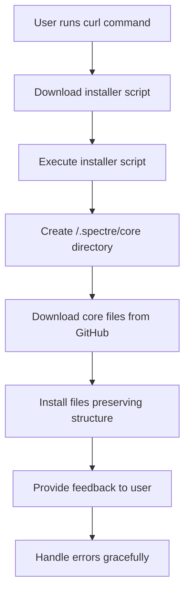

# Spectre Core Installer - Technical Specification

## Overview

The Spectre Core Installer is a shell script-based deployment mechanism that enables one-command installation of the Spectre core functionality. The installer downloads core files from a raw GitHub URL and installs them into the user's local `/.spectre/core` directory.

## Architecture

### High-Level Architecture



### Component Structure

- **Installer Script** (`install.sh`): Main shell script executable via `curl | sh`
- **Core Files Repository**: GitHub repository containing `/.spectre/core` files
- **Local Installation Target**: `/.spectre/core` directory on user's system
- **Error Handling Module**: Built-in error detection and reporting
- **Feedback Module**: User communication and progress reporting

## Components and Interfaces

### 1. Installer Script (`install.sh`)

**Purpose**: Main entry point for the installation process

**Key Functions**:
- Self-contained shell script
- No external dependencies beyond standard Unix tools
- Compatible with bash, zsh, and other POSIX shells
- Handles all installation logic internally

**Interface**:
```bash
# Input: None (self-contained)
# Output: Installation status and feedback
# Error Handling: Graceful failure with meaningful messages
```

### 2. GitHub Raw URL Interface

**Purpose**: Source for downloading core files

**Specifications**:
- URL Format: `https://raw.githubusercontent.com/[username]/spectre/main/.spectre/core/`
- File Access: Direct file downloads via HTTP
- Content Type: Plain text files (markdown, shell scripts)
- Authentication: Public repository, no authentication required

### 3. Local File System Interface

**Purpose**: Target for core file installation

**Specifications**:
- Target Directory: `/.spectre/core`
- File Permissions: Readable by user
- Directory Creation: Automatic if not exists
- Backup Strategy: None (simple overwrite)

## Data Models

### Core Files Structure

```
/.spectre/core/
├── exec-tasks.md
├── gen-requirement.md
├── gen-tasks.md
└── gen-spec.md
```

### Installation Process Data Flow

1. **Download Phase**
   - Source: GitHub raw URLs
   - Target: Temporary local storage
   - Validation: File existence and basic integrity

2. **Installation Phase**
   - Source: Temporary files
   - Target: `/.spectre/core/`
   - Validation: Directory creation and file copying

3. **Verification Phase**
   - Source: Installed files
   - Validation: File count and basic structure

## Error Handling

### Error Categories

1. **Network Errors**
   - GitHub URL unreachable
   - File download failures
   - Timeout issues

2. **File System Errors**
   - Insufficient permissions
   - Disk space issues
   - Directory creation failures

3. **Validation Errors**
   - Missing core files
   - Corrupted downloads
   - Invalid file structure

### Error Response Strategy

```bash
# Error handling pattern
if [ $? -ne 0 ]; then
    echo "Error: [specific error message]"
    echo "Please check: [troubleshooting steps]"
    exit 1
fi
```

### User Feedback Levels

1. **Info**: Installation progress and status
2. **Success**: Confirmation of successful installation
3. **Warning**: Non-critical issues that don't stop installation
4. **Error**: Critical issues that prevent installation


## Implementation Details

### Installer Script Structure

```bash
#!/bin/bash
set -e  # Exit on any error

# Configuration
REPO_URL="https://raw.githubusercontent.com/[username]/spectre/main"
CORE_DIR=".spectre/core"
TARGET_DIR="$HOME/.spectre/core"

# Functions
log_info() { echo "[INFO] $1"; }
log_error() { echo "[ERROR] $1" >&2; }
log_success() { echo "[SUCCESS] $1"; }

# Main installation logic
main() {
    log_info "Starting Spectre Core installation..."
    
    # Create target directory
    mkdir -p "$TARGET_DIR"
    
    # Download and install core files
    install_core_files
    
    # Verify installation
    verify_installation
    
    log_success "Installation completed successfully!"
}

# Implementation functions
install_core_files() {
    # Download each core file
    # Preserve directory structure
    # Handle errors gracefully
}

verify_installation() {
    # Check file existence
    # Verify file count
    # Validate basic structure
}

# Execute main function
main "$@"
```

### Security Considerations

1. **Script Integrity**: Use HTTPS URLs only
2. **File Permissions**: Set appropriate read permissions
3. **Error Boundaries**: Prevent partial installations
4. **User Feedback**: Clear communication of all operations

### Performance Considerations

1. **Minimal Dependencies**: Use only standard Unix tools
2. **Efficient Downloads**: Single file downloads where possible
3. **Quick Execution**: Optimize for fast installation
4. **Resource Usage**: Minimal disk and network usage

## Deployment Strategy

### GitHub Repository Structure

```
spectre/
├── .spectre/
│   └── core/
│       ├── exec-tasks.md
│       ├── gen-requirement.md
│       ├── gen-tasks.md
│       └── gen-spec.md
├── install.sh
└── README.md
```

### Distribution Process

1. **Script Development**: Create `install.sh`
2. **Repository Setup**: Configure GitHub repository
3. **Raw URL Access**: Ensure files accessible via raw.githubusercontent.com
4. **Documentation**: Update README with installation instructions
5. **Validation**: Manual validation of installation process
6. **Release**: Tag and release stable version

### Installation Command

```bash
curl -sSL https://raw.githubusercontent.com/[username]/spectre/main/install.sh | sh
```

## Future Enhancements

1. **Version Management**: Support for different core versions
2. **Update Mechanism**: Ability to update existing installations
3. **Uninstall Option**: Clean removal of core files
4. **Configuration Options**: Custom installation paths
5. **Rollback Capability**: Restore previous versions
